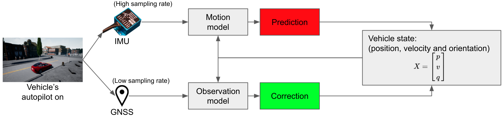
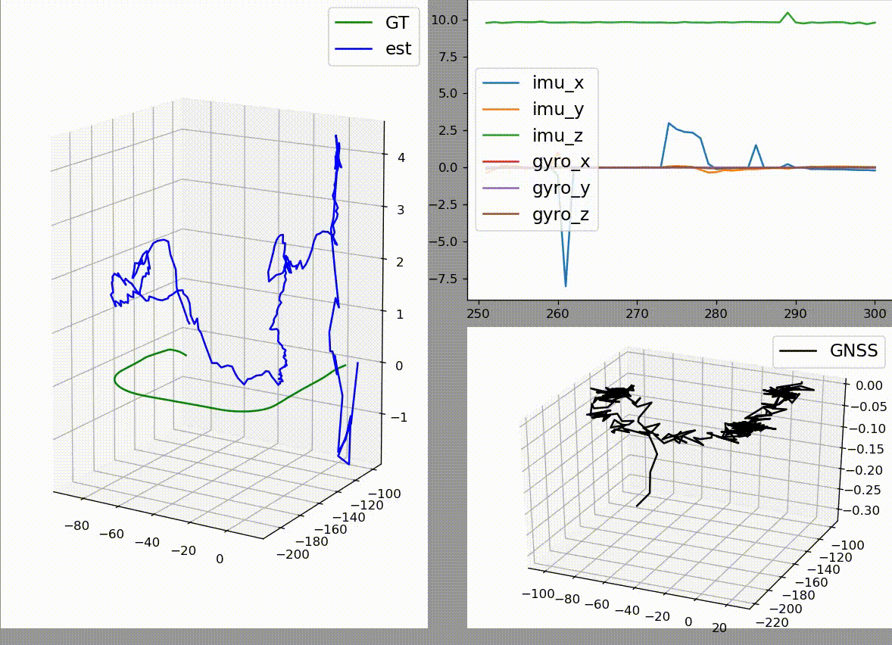

# Real-time error-state extended Kalman Filter (ES-EKF)

## Introduction
This is a tutorial to understand error-state extended Kalman filter (ES-EKF) for real-time vehicle trajectory estimation in Carla simulator. 
<p float="left">
  
</p>


I used to struggle to wrap my head around the implementation of Kalman filter. If you are like me, you might have heard of this awesome technique named Kalman filter that had been used to estimate rocket position in the [Apollo missions in the 60s](https://www.cs.unc.edu/~welch/kalman/siam_cipra.html). While you can find a lot of resources explaining how Kalman filter works in theory, most of them come with a toy example or a simplified application that does not even apply in challenging real-word situations.

In essense, Kalman filter is a way to extract accurate information out of inaccurate inputs. In the context of self-driving cars, Kalman filter can be used to estimate the position, orientation and velocity of a vehicle given noisy sensor inputs (e.g., wheel odometry, camera, LiDAR, GPS. etc.). Specifically, in this project we will study how can we use noisy GPS/GNSS and IMU signals to localize a vehicle being automatically driven in a simulated environment.

(From top to bottom: visualization of sensor signals and vehicle trajectory, image captured by the moving vehicle, Carla simulator)
<p float="left">
  
</p>
<p float="left">
  
</p>
<p float="left">
  
</p>

## To-do

- [ ] Add mathematical formulas and explanations in a sub-directory
- [ ] Parameter tuning (Noise variances in EKF)

## Limitations
- Initialization of the EKF state 
  - Currently using an average of 10 GNSS positions to estimate the initial position. The orientation and velocity are initialized as Identity and zero velocity. That is why the vehicle trajectory is bad in the beginning and needed to be corrected using subsequent GNSS signals.
- Sensor noise variances are not optimized.

## Dependencies
* CARLA (tested 0.9.11)
* Python 3.7
* pygame (>=2.0)
* Matplotlib (tested 3.1.3)

## Tested environment
* Ubuntu 20.04
## Hardware requirement
Tested on a laptop equipped with an Intel 7820HK and an Nvidia 1070 GPU. [Carla simulator](https://carla.org/) is very computationally demanding and my laptop can barely keep up (which explains why I limit the visualization frame-rate). Use this as a baseline to get a sense of how it would work on your computer.

## Download instructions
1. Download [CARLA 0.9.11](https://github.com/carla-simulator/carla/releases/tag/0.9.11) and extract the precompiled Carla package in a folder
2. `cd CARLA_0.9.11 && cd PythonAPI`
3. `git clone https://github.com/yan99033/real-time-carla-kalman-filter.git`

## How to use
1. Launch Carla simulator
```sh
cd CARLA_0.9.11
./CarlaUE4.sh
```

**NOTE:** before running Step 2, make sure that the visualization works
```sh
cd PythonAPI && cd real-time-carla-kalman-filter
python3 visualize_sensors.py
``` 

2. Run Kalman filter
```sh
cd PythonAPI && cd real-time-carla-kalman-filter
python3 run_kalman_filter.py
```

## Contribution guidelines
We welcome any patches or bug fixes to enhance the code base. 

Here are some basic rules to follow:
- For blatant typos in the documentation, just submit a pull request
- To add new features, create an issue so that we can discuss about it
- To fix a bug, 
  - find the existing issue or create a new issue
  - submit a pull request and tag the issue
- Follow the existing style whenever possible (e.g., `snake_case`, docstring format, adequate comments, limited inline comments, etc.)


## Acknowledgement
I certainly learned a lot from the [State Estimation and Localization for Self-Driving Cars course](https://www.coursera.org/learn/state-estimation-localization-self-driving-cars) offered by Coursera. The script, `rotations.py`, is taken directly from the course.

## Licence
This project is totally free to use, although credit would be appreciated in case of any reuse of the work.
